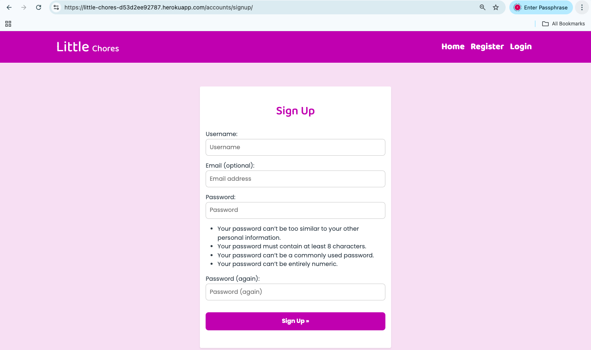

# Little-chores

Little Chores is a child-friendly task and reward web application designed to help parents encourage positive habits through age-appropriate chores.
The application supports parents in managing tasks for their children while motivating children through positive reinforcement using stickers and encouraging feedback.

## Project Goals

- The application is designed to help parents understand the importance of involving children in everyday chores in an age-appropriate way, while learning about the benefits these activities have on children’s development.
- It also allows parents to safely suggest new tasks without immediate public visibility, helping to keep parents engaged in their children’s physical learning journey.
- All shared tasks are reviewed and approved by an admin to ensure they remain safe and appropriate.
- The application supports children through positive reinforcement of good habits.
- A simple and accessible interface is maintained to support daily family use.

## User Roles

As a Parent / Guardian, I want to: 

- Manages children and their tasks
- Chooses tasks from an approved task library
- Suggests new tasks for admin approval
- Marks tasks as completed and views rewards

As a Child, I want to:

- Views tasks in clear, child-friendly language
- Receives stickers and positive feedback for completed tasks

As an Admin, I want to:

- Manages users via Django admin
- Reviews and approves parent-submitted task suggestions
- Controls which tasks appear in the public task library

## Wireframes

Low-fidelity, hand-drawn wireframes were created during the planning phase to map out: Home page layout, parent dashboard, task management flow, sticker reward views and mobile adaptations.
Wireframes were intentionally kept low-fidelity to focus on structure and user flow rather than visual styling.

## Design Choices
### Typography

To create a design that feels friendly and engaging for children while remaining clear and accessible for parents, two Google Fonts were selected:

- Baloo 2 (used for headings and section titles)
Baloo 2 has rounded, playful letterforms that feel warm and approachable without sacrificing readability. Its soft curves help create a welcoming tone that suits a child-focused reward system while still appearing polished and professional.

- Poppins (used for body text, buttons, and form elements)
Poppins is a clean, modern sans-serif font that ensures excellent readability across all screen sizes. Its simple structure balances the playful nature of Baloo 2, making it ideal for longer text, labels, and user interactions.

### Colour Palette
The Little Chores colour palette was designed to create a calm, supportive, and child-friendly environment while remaining clear and trustworthy for parents. Soft pastel tones are used for backgrounds to reduce visual strain, while brighter accent colours highlight rewards, actions, and positive feedback.
I used  to explore harmonious colour combinations and [Contrast Grid](https://contrastgrid.com/?xAxisData=%255B%257B%2522color%2522%253A%2522%2523F9FAF7%2522%257D%252C%257B%2522color%2522%253A%2522%2523FFFFFF%2522%257D%252C%257B%2522color%2522%253A%2522%2523AF31AF%2522%257D%252C%257B%2522color%2522%253A%2522%25232F3A44%2522%257D%252C%257B%2522color%2522%253A%2522%2523C5DFFC%2522%257D%252C%257B%2522color%2522%253A%2522%2523F7ECC9%2522%257D%252C%257B%2522color%2522%253A%2522%25238BC8A5%2522%257D%255D)to ensure sufficient contrast between text and background elements.

| CSS Variable Name     | HEX      | Usage & Purpose                                               |
| --------------------| ------- | ---------------------------------------------------------------- |
| --soft-cream        | #F3E2F3 | Main page background – calm, clean, and easy on the eyes         |              
| --calm-sky-blue     | #519EF6 | Dashboard elemets background                                     |
| --soft-growth-green | #16B690 | Dashboard elemets background                                     |
| --soft-yellow       | #F4C430| Dashboard elemets background                                     |
| --charcoal-text     | #2F3A44 | Main text colour softer than black for improved readability      |
| --brand-purple      | #B045B0 | Navbar, footer backgroundcolour and titles                                  |

### Images

Icons used throughout the application were sourced from Font Awesome.  

### Responsiveness

My website is responsive to different layouts depending on the size of the viewport have been included in the CSS media queries. This allows visitors to experience the website as I intended on device types and screen sizes. The breakpoints I am using are from Bootstrap.

### Case Diagram

### Database schema

## Features

### Existing Features

| Feature                      | Description                                                                                                            | Screenshot                                                |
| ---------------------------- | ---------------------------------------------------------------------------------------------------------------------- | --------------------------------------------------------- |
| **User Authentication**      | Users can register, log in, and log out securely. Only logged-in parents can manage children and chores.               |            |
| **Add Child**                | Parents can add children by entering the child’s name and date of birth. Each child is linked to the logged-in parent. |        |
| **Children Management**      | The dashboard displays a list of the parent’s children with options to edit or delete them.                            |    |
| **Children Management**      | The dashboard displays a list of the parent’s children with options to edit or delete them.                            |    |
| **Assign Chores**            | Parents can select a child and assign only age-appropriate chores using checkboxes.                                    |    |
| **To Do & Completed View**   | Assigned chores are shown in a To Do list and move to Completed when marked as done.                                   |   |
| **Mark Chores as Complete**  | Parents can mark one or more chores as completed using checkboxes.                                                     |    |
| **Delete Assigned Chores**   | Assigned chores can be deleted from the To Do list if added by mistake.                                                |     |
| **Daily Chore Tracking**     | Parents can track which chores are completed and which remain pending.                                                 |   |
| **Responsive Dashboard**     | The dashboard provides clear cards for Children, Assign Chores, To Do & Completed, and Rewards.                        |        |
| **Secure Data Access**       | Parents can only view and manage their own children and assigned chores.                                               |         |

## Tests
### HTML validation tests

| Page                  | URL / Template                             | Validation Issues                                                                                          | Status      | Notes                                                                                                                     |
| --------------------- | ------------------------------------------ | ---------------------------------------------------------------------------------------------------------- | ----------- | ------------------------------------------------------------------------------------------------------------------------- |
| **Home**              |   | • Duplicate `id="task-list"` • Heading level skipped (`h1` → `h4`) • Trailing slash on void elements |  Not fixed | Attempted refactor caused loss of styling on the home page after deployment. Issue documented for future improvement.     |
| **To-Do / Completed** |  | • `
` used inside `<label>` (invalid HTML structure) • Trailing slash on void elements              | Not fixed | Issue caused by form layout structure. Left unchanged to preserve functionality and styling. Planned for future refactor. |
| **Dashboard**         |          | • Initial duplicate IDs • Heading hierarchy issues                                                      |  Fixed     | Duplicate IDs removed and heading structure corrected. Page now passes validation checks where applicable.                |

| **Bug**                                                         | **Cause**                                               | **Fix / Solution**                                                                                   |
| --------------------------------------------------------------- | ------------------------------------------------------- | ---------------------------------------------------------------------------------------------------- |
configured `STATIC_ROOT` and `STATICFILES_STORAGE` |
| `NameError: name 'date' is not defined`                         | `date` was used without being imported                  | Imported `date` from `datetime`                                                                      |
| `ImportError: cannot import name 'assign_tasks'`                | Function name mismatch between `views.py` and `urls.py` | Ensured the function name and import matched correctly                                               |
| `TemplateDoesNotExist` error                                    | Incorrect template path or filename                     | Corrected folder structure and template name                                                         |                                                         |
| Chores not filtered by child age                                | Chores queryset was not filtered dynamically            | Filtered chores using the selected child’s `age_group()`                                             |
| Chores not updating when selecting another child                | No refresh logic for form selection                     | Handled using javascript to  refresh queryset                                               |                                             |
| Duplicate chores appearing in To-Do list                        | Assigned tasks were created without uniqueness checks   | Prevented duplicate assignments per child and task                                                   |
| Completed chores not adding rewards                             | Stickers not incremented on completion                  | Updated logic to increment `stickers_awarded` when status changed to `done`                          |
| Rewards not showing total stars                                 | Rewards were not aggregated per child                   | Used `Sum("stickers_awarded")` (This is still not working and I am working on it).                                                     |
| Mark-as-complete not updating status                            | Status field not updated correctly                      | Set `status="done"` and added `completed_at` timestamp                                               |
| Assigned chores couldn’t be deleted                             | No delete functionality implemented                     | Added delete logic using selected task IDs                                                           |
| Styling looked different on Heroku                              | Static files cache and missing collectstatic            | When I change Debug to False the Styles does not load(still working on this)                                                    |

## Deployment

The site was deployed to Heroku. The steps to deploy are as follows:

- After pushing all content to the repository, navigate to Heroku.
- In the [Heroku Dashboard](https://heroku.com/dashboard), navigate to the Project that you're working on.
- Click on the 'Deploy' button located near the top left of the page.
- Deployment method: Github > then select the repository to connect to.
- Enable automatic deploys.
- Deploy branch.

The live link can be found [here](https://little-chores-d53d2ee92787.herokuapp.com/dashboard/delete-child/11/).

